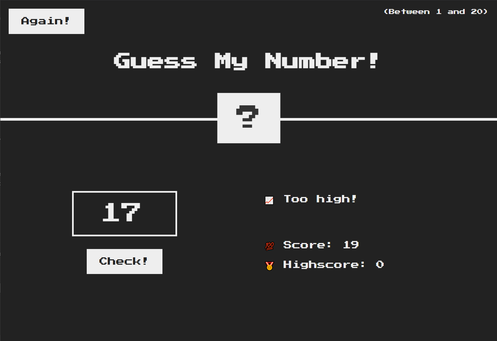

# Guess My Number

A simple, responsive number guessing game with a retro design, built using HTML, CSS, and JavaScript.

## 📸 Game Preview



## ⚙️ Features

-  ✅ Fun and interactive game
-  ✅ Nice looking retro design 🕹️
-  ✅ Fully responsive design
-  ✅ Real-time score tracking

## 👨🏻‍💻 Technologies Used

-  HTML5 & CSS3
-  JavaScript

## 🛠️ How It Works

The game picks a random number between 1 and 20. Your goal is to guess it by typing a number. The game will tell you if your guess is too high or too low. Once you guess it right, you can play again and try to beat your highscore! 🎉

## 📝 Rules

1. **Start Each Game**: You begin with a score of **20** at the start of each game.
2. **Incorrect Guesses**: Each wrong guess will make you lose **1 point** from your score. ❌
3. **Correct Guess**: When you guess the correct number, the game ends with the remaining score (e.g., if you guessed wrong 4 times, your score will be 16).
4. **Highscore Tracking**: After the game ends, your final score is compared with your **highscore**. If it’s higher, it will become your new highscore. 🏆
5. **Reset and Replay**: You can reset the game at any time by clicking the reset button and try to beat your highscore. 🎯🏆

## 🏁 Getting Started

Follow these steps to set up and run the game on your local machine.

### 📋 Prerequisites

Make sure you have:

-  A modern web browser (Chrome, Firefox, Edge, Safari)
-  A text editor (VS Code, Sublime Text, etc.)

## 🚀 Installation & Usage

1️⃣ **Download or Clone the Project**

-  **Manual Download**:
   1. Click on the **Code** button at the top of the GitHub page.
   2. Select **Download ZIP** and extract the folder on your PC.
-  **Using Git (optional)**:

   ```bash
   git clone https://github.com/YannWoj/Guess-My-Number.git
   ```

   2️⃣ **Open the Project**

-  Open the folder in **VS Code** or any text editor.

   3️⃣ **Run the Calculator**

-  **Method 1**: Double-click on `index.html` to open it in your web browser.
-  **Method 2 (Live Server)**:
   1. Install the **Live Server** extension in VS Code.
   2. Right-click `index.html` > **"Open with Live Server"**.

## ✨ Enjoy!

Have fun while playing and trying to beat your highscore! 🎮
